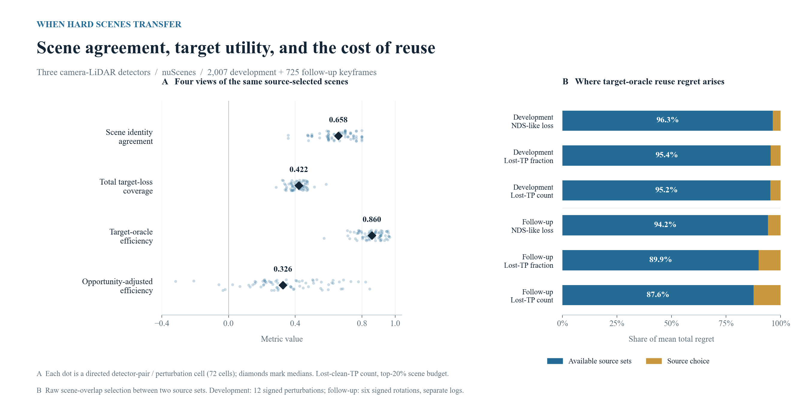
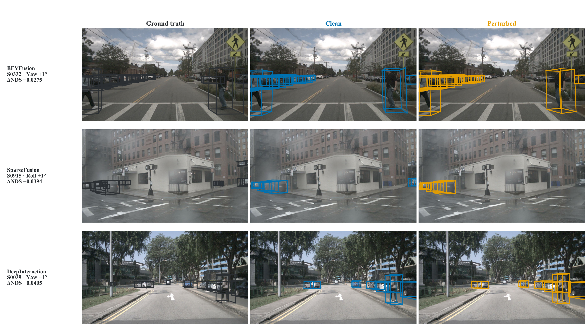

# Stress-set transfer in 3D detection

**When Does a Model-Mined Stress Set Transfer? A Utility- and Reference-Aware Audit in 3D Detection**  
Jinze Gao · Jie Ma

Hard scenes selected by one perception model are often reused to evaluate another. This project studies what that reuse preserves: the identity of difficult scenes, the amount of target loss captured, and efficiency relative to a target-specific selection at the same budget.

The analysis combines exact treatment of selection ties, references conditioned on acquisition logs and clean-detection opportunity, and a decomposition of reuse regret into candidate-set availability and source-choice error.

[Reproduce the analysis](REPRODUCE.md) · [Method and data](METHOD.md) · [Citation](CITATION.cff)



## Study

Three camera–LiDAR detectors—**BEVFusion, SparseFusion, and DeepInteraction**—are evaluated on selected nuScenes validation scenes. Each perturbation is applied to the same ordered frames across detectors.

| Partition | Scenes | Keyframes | Acquisition logs | Calibration conditions |
|---|---:|---:|---:|---|
| Development | 50 | 2,007 | 9 | Clean + 12 signed perturbations |
| Rotation follow-up | 18 | 725 | 9 separate logs | Clean + 6 signed rotations |

Perturbations comprise ±1° roll, pitch, and yaw, and ±0.10 m translation along each axis. The follow-up examines rotations, the family with stronger effects in development. Scene selection uses metadata and ground truth; the two partitions have disjoint acquisition logs.

## Results

At the **20% scene budget**, the same source-selected sets yield different answers depending on the quantity measured. For lost-clean-true-positive counts, development medians across 72 directed detector-pair/perturbation cells are:

| Quantity | Median |
|---|---:|
| Scene identity agreement | 0.658 |
| Fraction of all target loss captured | 0.422 |
| Efficiency relative to the target's same-budget selection | 0.860 |
| Efficiency adjusted for clean-detection opportunity within logs | 0.326 |

When raw scene overlap chooses between the two available source sets, **87.6–96.3% of mean target-oracle reuse regret comes from candidate-set availability** across the three loss definitions and both partitions. For the development lost-count outcome, total regret is **0.1165 = 0.1109 availability + 0.0056 selection**. The decomposition identifies where better candidate scenes could improve reuse.

The released [development](results/development.json) and [follow-up](results/followup.json) results include every cell, the 10%/20%/30% budget analyses, conditional randomization, and leave-one-log-out sensitivity. The figure can be regenerated from these files with [analysis/figures.py](analysis/figures.py).

## Run

Use Python 3.13 and install the analysis dependencies:

```bash
python -m venv .venv
source .venv/bin/activate
python -m pip install -r requirements.txt
python reproduce.py
python -m pytest -q
```

The reproduction command recomputes both partitions from the included derived data, validates 324 primary transfer cells and 324 source-choice checks, compares 1,022 reported numerical results, and redraws the overview figure. It runs on a CPU. The test suite contains 52 tests covering tie handling, reference construction, regret decomposition, matching metadata, and cross-fitted risk analysis.

For item-level failure-sharing references and held-log target-risk ranking, run `python reproduce.py --references`. [REPRODUCE.md](REPRODUCE.md) describes the inputs and outputs of each analysis.

## Visual examples



Camera-view examples from nuScenes compare clean and perturbed detector outputs. [Vector figure](assets/qualitative.pdf). Images: nuScenes, Caesar et al., CVPR 2020. Numerical results are computed over the partitions listed above.

## Contents

| Location | Purpose |
|---|---|
| `analysis/transfer.py` | Scene selection, transfer metrics, conditional references, and regret decomposition |
| `analysis/reference_models.py` | Failure-sharing references, matching sensitivity, and held-log risk ranking |
| `analysis/validate.py` | Independent reconstruction of cell-level arithmetic |
| `analysis/figures.py` | Source-backed PNG and vector SVG figures |
| `data/` | Scene partitions, detector-derived summaries, and target-level Parquet tables |
| `results/` | Cell-level development and follow-up results |
| `tests/` | Portable tests of the analysis methods |

## Citation and data

Citation metadata is in [CITATION.cff](CITATION.cff). The analysis code is distributed under the [MIT License](LICENSE). nuScenes-derived records and imagery retain the [dataset's terms](https://www.nuscenes.org/terms-of-use); [METHOD.md](METHOD.md) records their provenance and field definitions.
